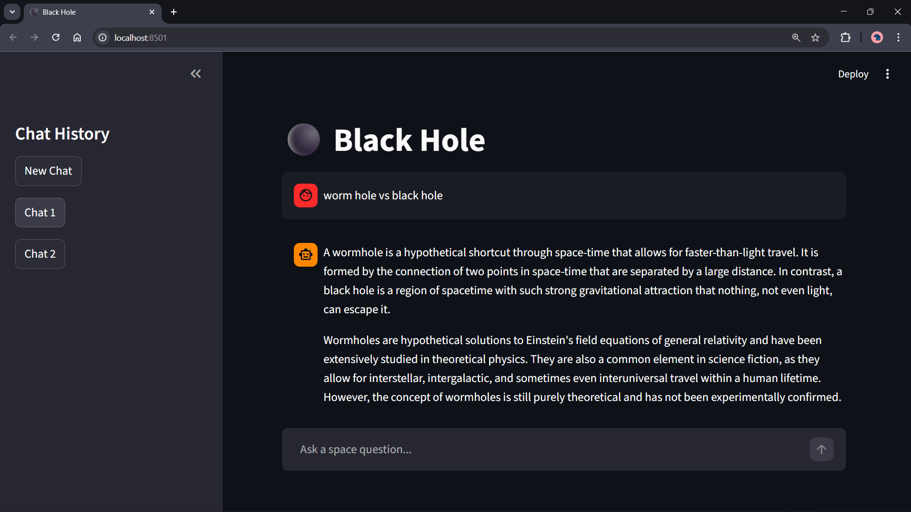

# ⚫Black Hole AI Assistant


An AI-powered assistant that answers space and black hole related questions using a **Retrieval Augmented Generation (RAG)** pipeline.

The system retrieves relevant scientific knowledge from a curated dataset and generates accurate answers using modern language models.

---

## Interface



## Demo
https://youtu.be/_tGzLKPYW6E?si=U59ZcaED7tEiEkVL

## Features

• Retrieval Augmented Generation (RAG) architecture  
• FAISS vector database for fast document search  
• Cross-encoder reranking for better context retrieval  
• FastAPI backend for scalable AI APIs  
• Streamlit chat interface  
• Supports Groq API and local Ollama models  
• Automatic knowledge base update agent

# 🏗️ System Architecture

User  
↓  
Streamlit Chat UI  
↓  
FastAPI Backend  
↓  
Sentence Transformer Embeddings  
↓  
FAISS Vector Database  
↓  
Cross Encoder Reranking  
↓  
LLM (Groq / Ollama)  
↓  
Answer + Sources

---

# 📂 Project Structure

```
black-hole-ai-assistant
│
├── src
│   ├── api.py
│   ├── build_index.py
│   ├── clean_data.py
│   ├── chunk_data.py
│   ├── retrieve_chunks.py
│   ├── knowledge_agent.py
│   ├── update_vector_db.py
│
├── data
│   ├── Raw_data.xlsx
│   ├── cleaned_data.csv
│   ├── chunks.csv
│   ├── vector_db.index
│
├── ui.py
├── requirements.txt
├── Dockerfile
├── docker-compose.yml
└── README.md
```

---

# ⚙️ Installation

Clone the repository

```bash
git clone https://github.com/YOUR_USERNAME/black-hole-ai-assistant.git
cd black-hole-ai-assistant
```

Create virtual environment

```bash
python -m venv venv
```

Activate environment

Windows

```bash
venv\Scripts\activate
```

Install dependencies

```bash
pip install -r requirements.txt
```

---

# 🔑 Environment Variables

Create a `.env` file:

```
GROQ_API_KEY=your_api_key_here
```

---

# ▶️ Running the Application

Start FastAPI backend

```bash
uvicorn src.api:app --reload
```

Start Streamlit UI

```bash
streamlit run ui.py
```

Open browser

```
http://localhost:8501
```

---

# 🐳 Running with Docker

Build containers

```bash
docker compose up --build
```

---

# 📊 Data Pipeline

1. Raw space articles collected
2. Data cleaned and processed
3. Documents split into chunks
4. Embeddings generated
5. FAISS vector index created

---

# 📈 Future Improvements

- Hybrid search (BM25 + vector search)
- Web search integration
- Larger scientific datasets
- Improved evaluation metrics
- Voice assistant interface

---

# 👨‍💻 Author

S Santosh Achary

Machine Learning & AI Enthusiast  
Interested in AI systems, space science, and intelligent assistants.

---

# ⭐ If you like this project

Give the repository a star!